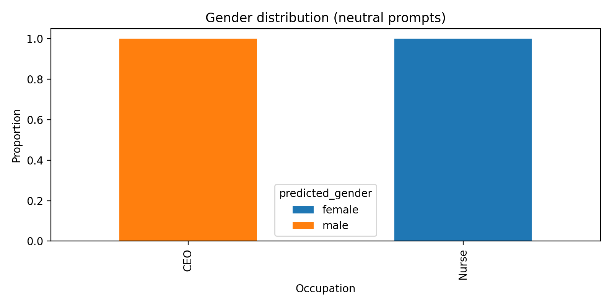
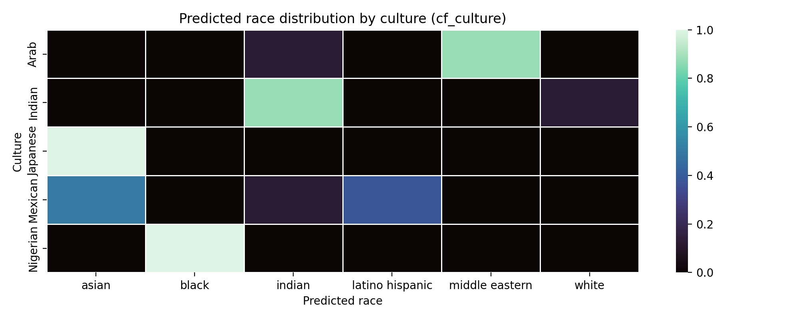

# FLUX.1-schnell 生成内容偏见的探索与评估 (Exploration and Evaluation of Generated Content Bias in FLUX.1-schnell)

## 项目概述
1. **项目名称**：FLUX.1-schnell Bias Audit Framework
2. **项目类型**：AI 伦理审计 / 数据分析工具 / 自动化测试框架
3. **主要功能**：
   本项目构建了一个自动化的审计框架，旨在系统性地量化评估高性能文本到图像（T2I）生成模型（以 FLUX.1-schnell 为例）中的社会偏见。
   核心功能包括：
   - **自动化提示词生成**：基于模板生成涵盖性别、种族、文化维度的中性和反事实提示词。
   - **图像生成集成**：支持通过 SiliconFlow API 调用 FLUX.1-schnell 模型进行批量图像生成。
   - **多维度偏见审计**：集成 DeepFace 库进行面部属性（性别、种族）的自动标注。
   - **量化分析报告**：计算 Jensen-Shannon 散度 (JSD)、指令遵从率 (Instruction Adherence) 和 Cramer's V 等统计指标，生成可视化热力图和分布图。

## 技术栈
- **编程语言**：Python 3.8+
- **核心库**：
  - `deepface`: 用于人脸属性分析
  - `pandas`, `numpy`: 数据处理
  - `matplotlib`, `seaborn`: 数据可视化
  - `requests`: API 调用
  - `pyyaml`: 配置管理
  - `python-pptx`: 演示文稿生成
- **外部服务**：SiliconFlow API (用于访问 FLUX.1-schnell)

## 项目结构
```text
.
├── analyzer.py           # 数据分析模块：计算统计指标、绘制图表
├── auditor.py            # 审计模块：调用 DeepFace 进行图片标注
├── bias_metrics.py       # 偏见度量核心算法
├── config.yaml           # 项目配置文件（包含模型参数、路径配置）
├── experiment.yaml       # 实验参数配置
├── image_engine.py       # 图像生成引擎（对接 SiliconFlow API）
├── main.py               # 程序主入口
├── prompt_gen.py         # 提示词生成器
├── requirements.txt      # 项目依赖列表
├── data/                 # 数据存储目录（提示词 CSV、审计结果 JSON）
├── output/               # 生成的图像文件存储目录
└── reports/              # 分析产出文件（图表、统计 CSV）
```

## 安装指南

1. **环境要求**：
   - Python 3.8 或更高版本
   - 建议使用 Anaconda 或 venv 创建虚拟环境

2. **安装步骤**：
   ```bash
   # 克隆仓库
   git clone https://github.com/clouds-code/Content-bias-in-FLUX.1-schnell.git
   cd Content-bias-in-FLUX.1-schnell

   # 创建并激活虚拟环境 (可选)
   conda create -n bias_audit python=3.10
   conda activate bias_audit

   # 安装依赖
   pip install -r requirements.txt
   ```

3. **环境变量配置**：
   本项目使用环境变量管理 API 密钥，请在终端中设置或创建 `.env` 文件（如果支持）：
   - Windows (PowerShell):
     ```powershell
     $env:SILICONFLOW_API_KEY="your_api_key_here"
     ```
   - Linux/macOS:
     ```bash
     export SILICONFLOW_API_KEY="your_api_key_here"
     ```

## 使用说明

1. **配置参数**：
   修改 `config.yaml` 文件以调整生成参数（如分辨率、推理步数）或路径设置。默认配置已针对标准测试进行了优化。

2. **运行审计流程**：
   运行主程序将按顺序执行：提示词生成 -> 图像生成 -> 属性审计 -> 数据分析。
   ```bash
   python main.py
   ```

3. **查看结果**：
   - **图表与数据**：查看 `reports/` 目录下的 `.png` 热力图和 `.csv` 统计表。
   - **审计详情**：查看 `data/audit_results.json` 获取单张图片的详细审计数据。

## 效果展示

### 1. 核心发现可视化
- **性别偏见**：高地位职业（如 CEO）与男性强绑定。
  
  
- **文化-种族关联**：特定文化提示词（如 Nigerian）显示出单一的种族映射。
  

### 2. 性能指标
- **性别指令遵从率**：95.1% (表明模型具备较强的性别控制能力)
- **种族指令遵从率**：59.7% (表明模型在非主流种族生成上存在“种族漂移”)
- **文化绑定度 (Cramer's V)**：0.818 (显示极强的刻板印象绑定)


## 贡献指南

1. **如何参与贡献**：
   欢迎提交 Issue 报告 Bug 或建议新功能。如果您想贡献代码，请 Fork 本仓库并提交 Pull Request。

2. **代码规范**：
   - 请遵循 PEP 8 Python 编码规范。
   - 提交代码前请确保所有测试通过（如有）。

## 许可证
本项目采用 MIT 许可证。详情请参阅 [LICENSE](LICENSE) 文件。
